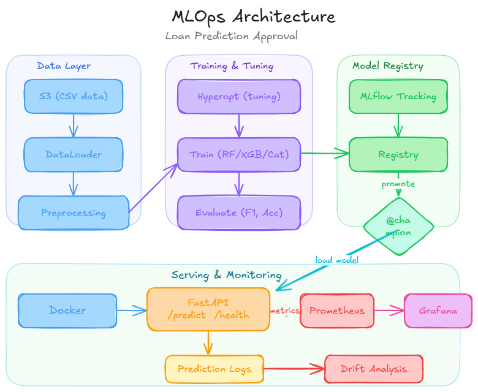

# Loan-prediction
Project part of Ensae "Mise en production" course

## Architecture MLOps



# How to start:
Clone the repo and follow the following steps:
## Environement creation and activation
```bash
uv sync
source ./venv/bin/activate
```
## Pre commit configuration
Run the following command to activate the pre-commit
```bash
pre-commit install
```

## Data loading:
The dataset used in this project is available in this Kaggle competition : https://www.kaggle.com/competitions/playground-series-s4e10/data.
Please download the train set `train.csv` and the test set `test.csv`, and store them in a bucket on SSPCloud.

`.env` file should contain the following variables : AWS_ACCESS_KEY_ID, AWS_SECRET_ACCESS_KEY, AWS_SESSION_TOKEN, AWS_S3_ENDPOINT, AWS_BUCKET_NAME, those variables are used to load the data.

## MLFlow initialisation
To test this version, please follow the previous steps and run :
```bash
python src/main.py 
```
and in another terminal, run 
```bash
mlflow ui --backend-store-uri sqlite:///mlflow.db
```
and open this link in your browser : http://127.0.0.1:5000


